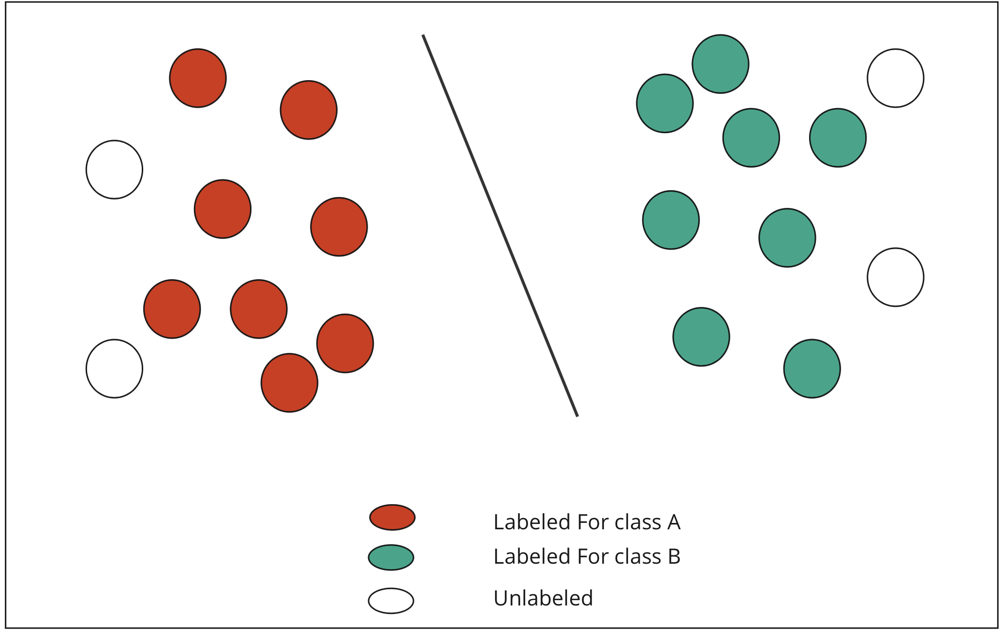

Semi-supervised learning is a machine learning method that falls between supervised and unsupervised learning. In Supervised learning, a model is trained on a labeled dataset, where the correct output is provided for each example in the training set. In Unsupervised learning, the model is not provided with labeled training examples, and must find patterns and relationships in the data on its own.

In semi-supervised learning, the model is trained on a dataset that is partially labeled. This means that only some of the examples in the training set have known, correct outputs. The model is then able to use this information, along with the patterns it finds in the unlabeled data, to make predictions on new examples.

  

In the former method they divide the semisupervised methods into inductive and Transductive method. there is a distinction between inductive semi-supervised learning and transductive learning. In inductive semi-supervised learning, the learner has both labeled training (𝑙) data {(𝐱𝑖,𝑦𝑖)} 𝑖=1  ∼ 𝑝(𝐱,𝑦) and unlabeled training data {𝐱j} j=𝑙+1 ∼ p(x), and learns a predictor 𝑓 : X ↦ Y f : X ↦ Y, 𝑓 ∈ F where F is the hypothesis space. Here x∈X is an input instance, y∈Y its target label (discrete for classification or continuous for regression), p(x, y) the unknown joint distribution and p(x) its marginal. The goal is to learn a predictor that predicts future test data better than the predictor learned from the labeled training data alone. In transductive learning, which has been understood since the very first theorems of Vapink-Chervonenkis (VC). firstly introduced in the  the setting is the same except that one is solely interested in the predictions on the unlabeled training data {𝐗j} j=𝑙+1, without any intention to generalize to future test data 

# What Are Graph Neural Network?

Graph neural network is one of the most Deep learning hot topics nowadays that has many applications in real world; as the graphs are everywhere around us. Many types of data will be better is it represented in a graph data structure as graphs are not taking huge memory size as complex architectures as Convolution Neural Networks https://arxiv.org/abs/1901.00596. 

In this Repo we reimplemented some of graph neural networks that working in a transductive way (Semi supervised). 

# 1- Graph Attention Networks

graph attention networks (GATs), novel neural network architectures that operate on graph-structured data, leveraging masked self-attentional layers to address the shortcomings of prior methods based on graph convolutions or their approximations. By stacking layers in which nodes are able to attend over their neighborhoods' features, we enable (implicitly) specifying different weights to different nodes in a neighborhood, without requiring any kind of costly matrix operation (such as inversion) or depending on knowing the graph structure upfront.

  

# 2- Graph convlutional Netowrks
Graph Convolution neural network is special type of Convolution neural network where the model deals with graph structured data. There are common types of problems that GCNs deal with:

1- Node classification: where each node needs to be classified based on the neighborhood nodes

2- Graph classification: this where the whole graph needs to be classified.

3- Link predictions: when you are interested in predicting the type of links between nodes. e.g bound prediction between atoms in medicinal chemistry.

  

# Cora Dataseet

The Cora dataset consists of 2708 scientific publications classified into one of seven classes. The citation network consists of 5429 links. Each publication in the dataset is described by a 0/1-valued word vector indicating the absence/presence of the corresponding word from the dictionary. The dictionary consists of 1433 unique words.

# In this repo 

the whole idea is about semi supervised learning so both folders' idea is about Transductive learning, as, when we do the fast forward, we use all nodes (train-test-val) assuming that test and val nodes have not labels but while calcuating the loss and training accuracy we use the training nodes only (Labeled nodes)

The code is well documented and easy to follow. 

# Licencse 

papers that implementeed in this Repo:

1- Graph Attention Networks  https://arxiv.org/abs/1710.10903
2- Semi-Supervised Classification with Graph Convolutional Networks. https://arxiv.org/abs/1609.02907

We used other official and unofficial Github implementations to reimplement these papers, So, Thanks to:
https://github.com/gordicaleksa/pytorch-GAT. and https://github.com/tkipf/pygcn 

